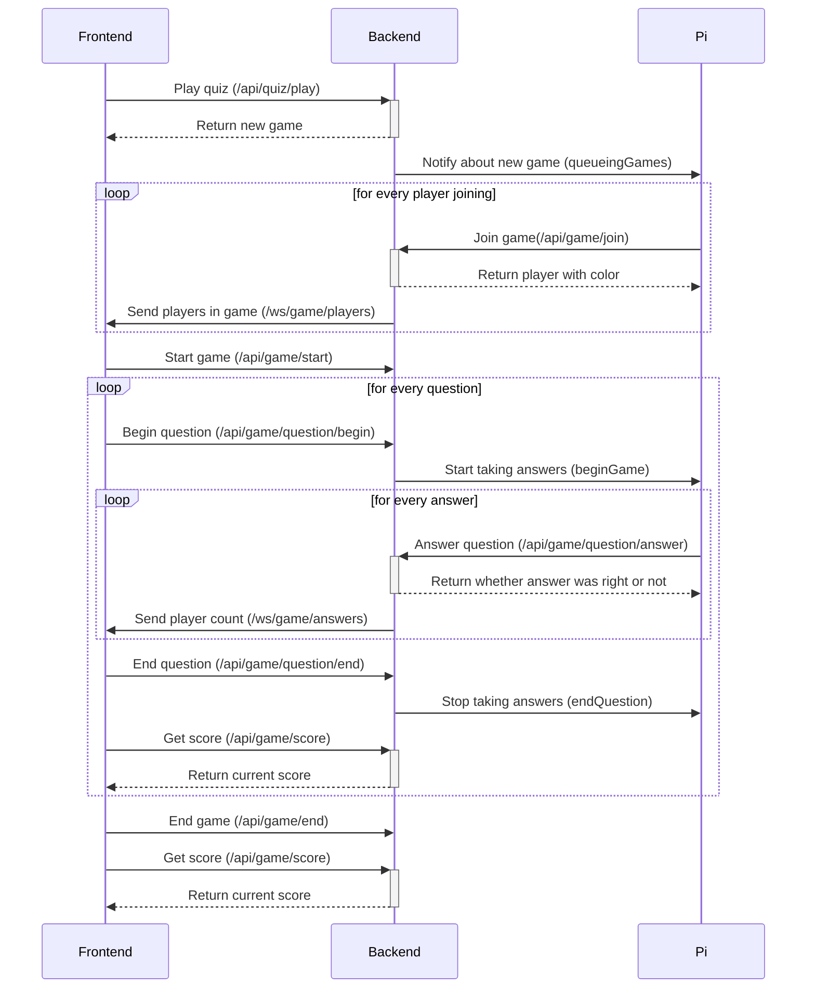

# API Design

**IMPORTANT: Open in Typora for proper formatting**

[TOC]

# API design - frontend

## REST

### Quiz

#### Create

Method: `POST`

URL: `/api/quiz`

Payload: [`Quiz`](#quiz)

Return value: [`Quiz`](#quiz)

#### Read

Method: `GET`

URL: `/api/quiz`

Return value: [`[Quiz]`](#quiz)

#### Read (single)

Method: `GET`

URL: `/api/quiz/{id}`

Parameters: `id: string`

Return value: [`Quiz`](#quiz)

#### Update

Method: `PUT`

URL: `/api/quiz/{id}`

Parameters: `id: string`

Payload: [`Quiz`](#quiz)

Return value: [`Quiz`](#quiz)

#### Delete

Method: `DELETE`

URL: `/api/quiz/{id}`

Parameters: `id: string`

#### Play

Method: `POST`

URL: `/api/quiz/{quizId}/play`

Parameter: `quizId: string`

Return value: [`Game`](#game)

### Question

#### Create

Method: `POST`

URL: `/api/quiz/{quizId}/question`

Payload: [`Question`](#question)

Return value: [`Question`](#question)

#### Update

Method: `PUT`

URL: `/api/quiz/{quizId}/question/{id}`

Parameters:

- `quizId: string`

- `id: string`

Payload:  [`Question`](#question)

Return value:  [`Question`](#question)

#### Delete

Method: `DELETE`

URL: `/api/quiz/{quizId}/question/{id}`

Parameters:

- `quizId: string`

- `id: string`

### Game

#### Queueing Games

Method: `GET`

URL: `/api/game/queuing`

Return value: [`[Game]`](#game)

#### Start

Method: `POST`

URL: `/api/game/{gameId}/start`

Parameters: `gameId: string`

#### End

Method: `POST`

URL: `/api/game/{gameId}/end`

Parameters: `gameId: string`

#### Begin question

Method: `POST`

Route: `/api/game/{gameId}/question/{questionId}/begin`

Parameters:

- `gameId: string`
- `questionId: string`

#### End question

Method: `POST`

Route: `/api/game/{gameId}/question/{questionId}/end`

Parameters:

- `gameId: string`
- `questionId: string`

#### Score

Method: `GET`

URL: `/api/game/{gameId}/score`

Parameters: `gameId: string`

Return value: [`Score`](#score)

## Websocket

### Players

Route: `/ws/game/{gameId}/players`

Arguments: `gameId: string`

Direction: Server -> Client

Payload: [`Player`](#player)

#### Answers

Route: `/ws/game/{gameId}/answers`

Arguments: `gameId: string`

Direction: Server -> Client

Payload: `integer` (amount of answers for current question)

# API design - Raspberry PI

## REST

### Join

Method: `POST`

URL: `/api/game/{gameId}/join`

Parameters: `gameId: string`

Return value: [`Player`](#player) (includes player color)

### Answer

Method: `POST`

URL: `/api/game/{gameId}/answer/{playerId}`

Parameters:

- `gameId: string`
- `playerId: string`

Payload: [`AnswerColor`](#answer-color)

Return value: boolean (true if correct, otherwise false)

## ZMQ Sockets

### Begin question

Topic: `beginQuestion/{gameId}`

Payload: [`[Answer]`](#answer)

### End question

Route: `endQuestion/{gameId}`

### Queueing Games

Route: `queueingGames`

Payload: [`[Games]`](#game) (only id and colorCode)


# Data Types

### Quiz

<a name="quiz"></a>

```json
Quiz {
    title: string,
    description: string,
    questions: [Question] //this is only returned from the backend. it will simply be ignored if sent from the frontend
}
```

### Question

<a name="question"></a>

```json
Question {
    question: string,
    answers: [Answer]
}
```

### Answer

<a name="answer"></a>

```json
Answer {
    id: string, //won't be sent to frontend
    answer: string, //won't be sent to raspberry pi
    color: AnswerColor
    isCorrect: boolean
}
```

### Game

<a name="game"></a>

```json
Game {
    id: string,
    colorCode: [AnswerColor; 8]
    quiz: Quiz
}
```

### Player

<a name="player"></a>

```json
Player {
    id: string,
    color: Color //serzialized to string
}
```

### Score

<a name="score"></a>

*Map with player as key and score as value*

```json
Score {
    Player => integer
}
```

### PlayerColor

<a name="player-color"></a>

```json
PlayerColor {
    RED("#FF0000"),
    GREEN("#00FF00"),
    BLUE("#0000FF"),
    LIGHTBLUE("#00FFFF"),
    YELLOW("#FFFF00"),
    PURPLE("#FF00FF")
}
```

### AnswerColor

<a name="answer-color"></a>

```json
AnswerColor {
    RED("#FF0000"),
    YELLOW("#FFFF00"),
    GREEN("#32CD32"),
    BLUE("#1E90FF")
}
```


# Sequence



