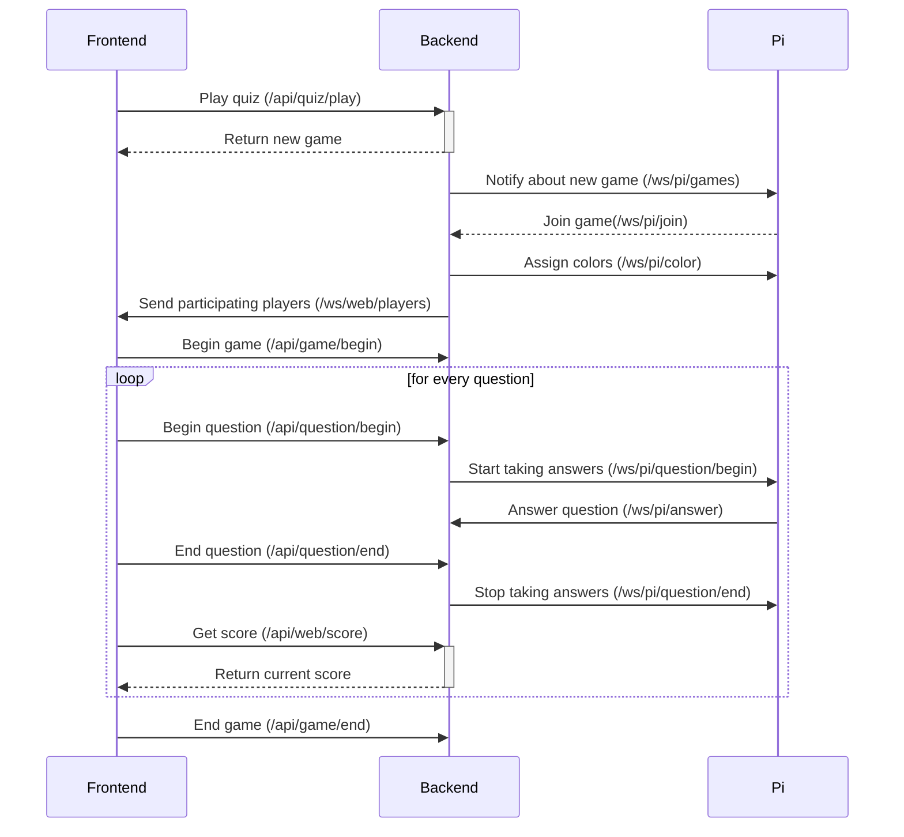

[TOC]

# API design - frontend

## REST

### Quiz

#### Create

Method: `POST`

URL: `/api/quiz`

Payload: [`Quiz`](#quiz)

Return value: [`Quiz`](#quiz)

#### Read

Method: `GET`

URL: `/api/quiz`

Return value: [`[Quiz]`](#quiz)

#### Read (single)

Method: `GET`

URL: `/api/quiz/{id}`

Parameters: `id: string`

Return value: [`Quiz`](#quiz)

#### Update

Method: `PUT`

URL: `/api/quiz/{id}`

Parameters: `id: string`

Payload: [`Quiz`](#quiz)

Return value: [`Quiz`](#quiz)

#### Delete

Method: `DELETE`

URL: `/api/quiz/{id}`

Parameters: `id: string`

#### Play

Method: `POST`

URL: `/api/quiz/play/{quizId}`

Parameter: `quizId: string`

Return value: [`Game`](#game)

### Question

#### Create

Method: `POST`

URL: `/api/question/{quizId}`

Payload: [`Question`](#question)

Return value: [`Question`](#question)

#### Update

Method: `PUT`

URL: `/api/question/{quizId}/{id}`

Parameters:

- `quizId: string`

- `id: string`

Payload:  [`Question`](#question)

Return value:  [`Question`](#question)

#### Delete

Method: `DELETE`

URL: `/api/question/{quizId}/{id}`

Parameters:

- `quizId: string`

- `id: string`

### Game

#### Start

Method: `POST`

URL: `/api/game/start/{gameId}`

Parameters: `gameId: string`

#### End

Method: `POST`

URL: `/api/game/end/{gameId}`

Parameters: `gameId: string`

#### Begin question

Method: `POST`

Route: `/api/game/{gameId}/question/{questionId}/begin`

Parameters:

- `gameId: string`
- `questionId: string`

#### End question

Method: `POST`

Route: `/api/game/{gameId}/question/{questionId}/end`

Parameters:

- `gameId: string`
- `questionId: string`

### Score

#### Read

Method: `GET`

URL: `/api/score/{gameId}`

Parameters: `gameId: string`

Return value: [`Score`](#score)

## Websocket

### Players

Route: `/ws/web/players/{gameId}`

Arguments: `gameId: string`

Direction: Server -> Client

Payload: [`WSEvent`](#ws-event)<[`Player`](#player)>


# API design - Raspberry PI

## REST

### Join

Method: `POST`

URL: `/api/game/join/{gameId}`

Parameters: `gameId: string`

Return value: [`Player`](#player) (includes player color)

### Answer

Method: `POST`

URL: `/api/game/{gameId}/answer`

Parameters: `gameId: string`

Payload: [`AnswerColor`](#answer-color)

Return value: 

## Websocket

### Begin question

Route: `/ws/pi/game/{gameId}/question/begin`

Direction: Server -> Client

Payload: [`WSEvent`](#ws-event)<[`[Answer]`](#answer)>

### End question

Route: `/ws/pi/game/{gameId}/question/end`

Direction: Server -> Client

### Queueing Games

Route: `/ws/pi/games`

Direction: Server -> Client

Payload: [`[Games]`](#game) (only id and colorCode)


# Data Types

### Quiz

<a name="quiz"></a>

```json
Quiz {
    title: string,
    description: string,
    questions: [Question] //this is only returned from the backend. it will simply be ignored if sent from the frontend
}
```

### Question

<a name="question"></a>

```json
Question {
    question: string,
    answers: [Answer]
}
```

### Answer

<a name="answer"></a>

```json
Answer {
    id: string, //won't be sent to frontend
    answer: string, //won't be sent to raspberry pi
    color: AnswerColor
    isCorrect: boolean
}
```

### Game

<a name="game"></a>

```json
Game {
    id: string,
    colorCode: [AnswerColor; 8]
    quiz: Quiz
}
```

### Player

<a name="player"></a>

```json
Player {
    color: Color //serzialized to string
}
```

### Score

<a name="score"></a>

*Map with player as key and score as value*

```json
Score {
    Player => integer
}
```

### WSMessage

<a name="ws-message"></a>

```json
WSMessage<T> {
    data: T,
    error: WSError
}
```

### WSError

<a name="ws-error"></a>

```json
WSError {
    code: number, // HTTP code
    message: string
}
```

### PlayerColor

<a name="player-color"></a>

```json
PlayerColor {
    RED("#FF0000"),
    ORANGE("#FFA500"),
    YELLOW("#FFFF00"),
    GREEN("#32CD32"),
    BLUE("#1E90FF"),
    PURPLE("#9400D3"),
    MAGENTA("#FF00FF")
}
```

### AnswerColor

<a name="answer-color"></a>

```json
AnswerColor {
    RED("#FF0000"),
    YELLOW("#FFFF00"),
    GREEN("#32CD32"),
    BLUE("#1E90FF")
}
```


# Sequence



